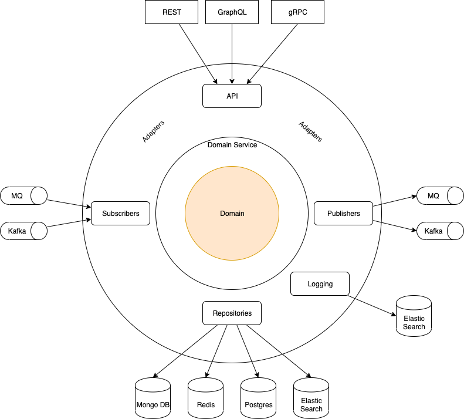

# Typescript Clean Architecture

### This project tries to follow the rules of [Uncle Bob's Clean Architecture](https://blog.cleancoder.com/uncle-bob/2012/08/13/the-clean-architecture.html).

## Table of Contents

- [Typescript Clean Architecture](#typescript-clean-architecture)
  - [This project tries to follow the rules of Uncle Bob's Clean Architecture.](#this-project-tries-to-follow-the-rules-of-uncle-bobs-clean-architecture)
  - [Table of Contents](#table-of-contents)
  - [Architecture](#architecture)
    - [Entities](#entities)
    - [Use Cases](#use-cases)
    - [Interface Adapters](#interface-adapters)
  - [Features](#features)
  - [Prerequisites](#prerequisites)
  - [Getting Started](#getting-started)
- [Prepare .env file](#prepare-env-file)
- [Development](#development)
- [Unit test](#unit-test)
- [Start server](#start-server)
- [API Document](#api-document)
  - [Project Structure](#project-structure)
  - [List of Packages](#list-of-packages)

## Architecture

<p align="center">
  <a href="https://www.draw.io/?lightbox=1&highlight=0000ff&edit=_blank&layers=1&nav=1&title=Software%20Architecture#R7Vtbc6M2GP01ftwdkLg%2BJna67TSZZuPOXp46MsigBiNGiNjOr68wwgaLZN0pYHndFw%2F6JAQ657sKeQKnq80nhrL4gYY4mQAj3EzgbAKAD4H4LQXbSmC7biWIGAkrkXkQzMkrlkJDSgsS4rw1kFOacJK1hQFNUxzwlgwxRtftYUuatJ%2BaoQgrgnmAElX6lYQ8llLT8Q8dv2ISxfLRHpDrW6F6sFxJHqOQrhsieDeBU0Ypr65WmylOSuxqXKr7fnmjd%2F9iDKf8lBu8tZ0bD2v4ZTn969v6a1J8maEPsJrlBSWFXLB8Wb6tERCzCLBF43YdE47nGQrKnrWgW8hivkpEyxSXKM8qBpZkg8VDb5ckSaY0oUzIUpqWU6CERKloBuKlMSvvp4y80pSjepYXzDgR%2BN%2FIkZyWj1EXK9dfDsebhkgu%2FhOmK8zZVgyRvRDY1S1SE01fttcHXu1a7eIGpXshkroU7ec%2BwC0uJOL%2FAn2goD%2BjK0RSIZtj9kIE0D8rG5ZttNiAtZk02ABOBxt7Ye9smG%2ByMQgHEwCXS%2BwEgZDnnNFn3OgJXX9hGP1AbRtHULsq1GYX1OZwUFsqqKHwu7Ip1ZPRIg1L3GYlEpTxmEY0Rck9LbVwh%2FDfmPOtjBqo4LSNv8CMbb%2BV93%2B06%2BZ3Od2uMdu0WlvZehP0nBYswO8sTK6LIxZh%2Fs446XrKRb9LIcMJ4uSlHYz6p8O%2BcjocvehwrpwOVys6wLXTAfTyVpYSp59wRnPCRfIiSoVjrg7EmD%2BO2KckSX2EZNgOyY7REZKNjpBsDRWRbQXUB5pGVIhmtwqkopTJystgmxCBLfsxrouKhPvFXoCC52hHzR8FF7PgcQmwzHYx4EKVgK6UyB0Kf6dDqUOiavPlQ28bmkHvKtA%2F0pxHrMOX%2FATo%2B5qh76mO57NuuDPKRVyjpcw3jsvknqo0HxxVaZ5KDOwgxhusRlO3ggbLcfZ9vec4%2Fok5jqdVimNCBfsxU87z02GaWvHhqyGiWCQkjzEbIeFsuJ%2BenI175Gysjigwbv5Z77E2IJ4XizxgZHGhGENLO4zVHc7f0fIZ%2FR9uBejWmcMt8EZ2%2Ba09ho%2FAHsznm%2B6pTt%2FQyumbamFwnanp%2FmOsLqkp8M9qK%2B6AtuJdqK2oZdzVhpZjczl%2FaFHj%2Fs3jb5eYUx3vm4Kz51Rg7C%2BZbVc0nCcC4ERPBKBWnqh%2B74ay39MoIml0iQrveG2Ft%2B2zK7x6ZOguQTknwaQ8tYJYEOvm9HvgwXOOePDPvG0K1A82V0CD42m2e10%2Ff7yNOjDSx2FwatVWz6iL%2F1ertqe7%2BZ%2FvOH%2BjH%2Bffg3pb9WlZqd6eq2i3P6avr19H05MPeEN44zbR2m9ei%2BvDTWXjvxsErI8fX5hBQDX73x3V%2Fnx%2FETZhw7bLP7tNjH500dXZKOCFGoWaxUZPj9OLsAjHcvWyCPXsyk2IMt713UYskbdBUxA6PnK%2BImGY7GwK5%2BQVLXZTlWxklKR8txj7dmLPyrmEGeWVRZntcszqrR5reyPYcXCr89T6YOCr6Y524H%2Bw7J7yI3M09EXz8NecXV%2Fj%2F03w7h8%3D" title="Click to edit">
    
</a>

### Entities

Entities encapsulate Enterprise wide business rules. An entity can be an object with methods, or it can be a set of data structures and functions. It doesn’t matter so long as the entities could be used by many different applications in the enterprise.

### Use Cases

The software in this layer contains application specific business rules. It encapsulates and implements all of the use cases of the system. These use cases orchestrate the flow of data to and from the entities, and direct those entities to use their enterprise wide business rules to achieve the goals of the use case.

### Interface Adapters

The software in this layer is a set of adapters that convert data from the format most convenient for the use cases and entities, to the format most convenient for some external agency such as the Database or the Web. It is this layer, for example, that will wholly contain the MVC architecture of a GUI. The Presenters, Views, and Controllers all belong in here. The models are likely just data structures that are passed from the controllers to the use cases, and then back from the use cases to the presenters and views.

## Features

coming soon

## Prerequisites

- [MongoDB](https://www.mongodb.com/download-center/community)
- [Node.js 8.0+](http://nodejs.org)
- [Visual Studio Code](https://code.visualstudio.com)
- Command Line Tools

## Getting Started

```bash
# Get the latest snapshot
git clone git@gitlab.com:sendit-th/ts-blueprint.git

# Change directory
cd ts-blueprint

# Install NPM dependencies
npm install
```

# Prepare .env file

Rename .env.example to .env and update key-value as needed

# Development

Start local servers as needed using script under ./scripts

```sh
npm run dev
```

# Unit test

```sh
npm test
```

# Start server

```sh
npm run build
npm start
```

# API Document

Open http://localhost/apidoc to see swagger api document

## Project Structure

```
.
├── .vscode                   # Contains VS Code specific settings
|   ├── extensions.json
|   ├── launch.json
|   └── settings.json
├── src                       # The actual source for the app goes here.
|   ├── adapters              # Interface adapter layer
│   │   ├── mongo.ts
│   │   └── setup.ts
|   ├── domains               # Business logic layer (Entities)
│   │   └── user
|   ├── externals             # External service (Interface adapter layer)
|   ├── libraries             # Internal library (Interface adapter layer)
|   ├── repositories          # Repository layer (Interface adapter layer)
│   │   └── user
|   ├── servers
│   │   ├── routers           # API endpoints go here
│   │   │   ├── errors        # Error format
│   │   │   │   └── basic.ts
│   │   │   ├── middlewares   # Custom app middleware folder
│   │   │   │   ├── middlewares.errorHandler.ts
│   │   │   │   └── middlewares.responseFormatter.ts
│   │   │   ├── system        # System endpoints folder
│   │   │   │   └── routers.system.ts
│   │   │   └── v1            # Application endpoints folder
│   │   ├── workers           # Queue management folder
│   │   └── index.ts          # Entry point to your koa app
|   ├── services              # Use cases layer
│   │   └── user
|   ├── utils                 # Utilities folder.
|   ├── bootstrap.ts
|   ├── config.ts             # Configuration file.
|   └── index.ts
├── .Dockerignore             # Folder and files ignored by docker usage.
├── .editorconfig             # Editor configuration file
├── .gitignore                # Folder and files ignored by git.
├── .prettierrc               # Role for prettierrc
├── Dockerfile                # Docker configuration file.
├── jest.config.js            # Used to configure Jest running tests written in TypeScript
├── nodemon.json              # Nodemon configuration file
├── package-lock.json         # Contains exact versions of NPM dependencies in package.json.
├── package.json              # NPM dependencies.
├── tsconfig.json             # Config settings for compiling server code written in TypeScript
├── tsconfig.release.json     # Config settings for compiling release written in TypeScript
└── tslint.json               # Config settings for TSLint code style checking
```

## List of Packages

| Package                    | Description                                                              |
| -------------------------- | ------------------------------------------------------------------------ |
| typescript                 | TypeScript is a language for application scale JavaScript development    |
| koa                        | Node.js web framework                                                    |
| koa-bodyparser             | A body parser for koa                                                    |
| koa-compress               | Compress middleware for koa                                              |
| koa-router                 | Router middleware for koa                                                |
| @koa/cors                  | Cross-Origin Resource Sharing(CORS) for koa                              |
| mongoose                   | MongoDB ODM                                                              |
| jest                       | Delightful JavaScript Testing.                                           |
| prettier                   | Prettier is an opinionated code formatter                                |
| rimraf                     | A deep deletion module for node (like `rm -rf`)                          |
| sendit-mongoose-repository | A mongoose Repository based Include Plugin                               |
| ramda                      | A practical functional library for JavaScript programmers                |
| dotenv                     | Loads environment variables from .env file                               |
| nodemon                    | Automatically restart Node.js server on code changes.                    |
| tslib                      | Runtime library for TypeScript helper functions                          |
| tsutils                    | Utilities for working with typescript's AST                              |
| tslint                     | An extensible static analysis linter for the TypeScript language         |
| tslint-config-prettier     | disables all conflicting rules that may cause such problems              |
| tslint-microsoft-contrib   | TSLint Rules for Microsoft                                               |
| ts-jest                    | A preprocessor with source maps support to help use TypeScript with Jest |
| ts-node                    | TypeScript execution environment and REPL for node.js                    |
| @types/jest                | TypeScript definitions for Jest                                          |
| @types/node                | TypeScript definitions for Node.js                                       |
